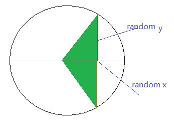

# 2011 笔试题笔记


---

### 腾讯2011笔试题


1.私有IP范围：

* A类 10.0.0.0--10.255.255.255
* B类 172.16.0.0--172.31.255.255
* C类 192.168.0.0--192.168.255.255

2.[逆波兰表示法](https://zh.wikipedia.org/wiki/%E9%80%86%E6%B3%A2%E5%85%B0%E8%A1%A8%E7%A4%BA%E6%B3%95)（也称，后缀表示法）

3.使用new来创建数组。

> int *p1 = new int[10];
 int *p2 = new int[10]();
 
[-](http://stackoverflow.com/questions/2468203/how-can-i-make-new-default-initialize-the-array-of-primitive-types) ,[-](http://stackoverflow.com/questions/2468367/is-new-int10-valid-c)

4.设计模式。

[Bridge pattern](https://en.wikipedia.org/wiki/Bridge_pattern)

**5.给定一个字符串，输出最长的重复子序列.**

思路：利用后缀数组。代码：
```C++
#include <iostream>
#include <cstring>
#include <algorithm>


using namespace std;

const int MAXLINE = 5000;

bool strCompare(char *str1, char *str2);
int getCommonPrefixLen(char *str1, char *str2);
void getSuffixStrArr(char *src, char *suffixStrArr[]);
void getLargestDuplicateSubstr(char *str);

int main(){
	char str[MAXLINE];
	cin.getline(str, MAXLINE);
	getLargestDuplicateSubstr(str);
	return 0;
}

void getLargestDuplicateSubstr(char *str){
	int len = strlen(str);
	char *suffixStr[MAXLINE];
	int commonPrefixLen;
	int maxLen = 0;
	int maxIndex = -1;

	getSuffixStrArr(str, suffixStr);

	sort(suffixStr, suffixStr+len, strCompare);

	for(int i=0; i<len-1; i++){
		commonPrefixLen = getCommonPrefixLen(suffixStr[i], suffixStr[i+1]);

		if(commonPrefixLen > maxLen){
			maxLen = commonPrefixLen;
			maxIndex = i;
		}
	}

	for(int i=0; i<maxLen; i++){
		cout << suffixStr[maxIndex][i];
	}
	cout << endl;
}

void getSuffixStrArr(char *src, char *suffixStrArr[]){
	int len = strlen(src);
	for(int i=0; i<len; i++)
		suffixStrArr[i] = &src[i];
}

int getCommonPrefixLen(char *str1, char *str2){
	int len = 0;
	while(*str1 && *str2){
		if(*str1 == *str2)
			len ++;
		else break;

		str1 ++;
		str2 ++;
	}
	return len;
}

// string ascending order  - O(N)
bool strCompare(char *str1, char *str2){
	if(strcmp(str1, str2) >= 0)
		return false;
	return true;
}
```

### 网易2011笔试题

在一冒险游戏里，你见到一个宝箱，身上有N把钥匙，其中一把可以打开宝箱，假如没有任何提示，随机尝试，问：

（1）恰好第K次（1=< K <=N）打开宝箱的概率是多少？

思路一：恰好第K次（1=< K <=N）打开宝箱，也就是说，打开宝箱的钥匙刚好排在第K把，所以把这个问题转化为可以开宝箱的钥匙在剩余的Ｎ-1把钥匙中的位置问题。
N-1把钥匙一共有N个空隙可以供给好钥匙插入（包括前头和末尾），总共有Ｎ种插法，即Ｎ总排列方法（严格来说不算排列，因为N-1把钥匙不用考虑顺序问题）。其中只有１种排列是好钥匙刚好在第Ｋ位上，所以是1/N。

思路二：直到第k次的尝试才把锁打开，所以前面的k次，每次都是没有命中那一把正确的钥匙：(1-1/n) * (1-1/(n-1)) * (1-1/(n-2)) *** (1/(n-k+1)) = 1/n

（2）平均需要尝试多少次？

思路：计算数学期望： 1*(1/n) + 2*(1/n) +3 *(1/n) +......+ n*(1/n) = （n+1）/2


### 百度2011笔试题

一、算法设计

1、设rand（s，t）返回[s,t]之间的随机小数，利用该函数在一个半径为R的圆内找随机n个点，并给出时间复杂度分析。

思路一：随机得到点，就是要随机得到x，y坐标，循环n次即可。



```java
int count = 0;
while( count < n){
    x = rand(-R, R);
    y = rand(-sqrt(R*R-x*x), sqrt(R*R-x*x));
    if(x*x + y*y != R*R) //排除正好落在圆上的情况
    {
        ++ count;
    }
}
```

2、为分析用户行为，系统常需存储用户的一些query，但因query非常多，故系统不能全存，设系统每天只存m个 query，现设计一个算法，对用户请求的query进行随机选择m个，请给一个方案，使得每个query被抽中的概率相等，并分析之，注意：不到最后一刻，并不知用户的总请求量。

思路：设置尺寸为m 个 query 的容器，如果请求数小于m，则直接入队，否则，用当前的 query 随机替换掉前面m个query 中的某一个。

3、C++ STL中vector的相关问题：

（1）、调用push_back时，其内部的内存分配是如何进行的？
（2）、调用clear时，内部是如何具体实现的？若想将其内存释放，该如何操作？

思路：内存容量的分配是成倍增加，并非每个插入都进行分配（我的想法：体现了amortized思想）。在clear的时候，只是清除了数据，没有释放内存（具体细节TODO）。

二、系统设计

正常用户端每分钟最多发一个请求至服务端，服务端需做一个异常客户端行为的过滤系统，设服务器在某一刻收到客户端A的一个请求，则1分钟内的客户端任何其它请求都需要被过滤，现知每一客户端都有一个IPv6地址可作为其ID，客户端个数太多，以至于无法全部放到单台服务器的内存hash表中，现需简单设计一个系统，使用支持高效的过滤，可使用多台机器，但要求使用的机器越少越好，请将关键的设计和思想用图表和代码表现出来。

**我的思路：**读完题目后，可以看到要分两步解决这个问题：1）“客户端个数太多，以至于无法全部放到单台服务器的内存hash表中”，所以要使用分布式集群来处理客户端请求，如何分发请求到具体机器？2）具体的机器在处理客户端请求时，频度是每分钟一个请求，如何设计这个过滤系统？

1） 可以使用一致性hash，细节自己看；
2） 每个客户端的ID是其IPv6地址，对于每个客户端我们为其设置一个时间戳变量 tsBegin，每当一个请求到来时，如果时间 now() - tsBegin < 1 分钟，则拒绝服务，否则更新 tsBegin=now()。以此来达到限制客户端访问频率的问题。


三、求一个全排列函数：

如p([1,2,3])输出：
[123]、[132]、[213]、[231]、[321]、[312]
 求一个组合函数。

**我的思路：**比较简单，两种方法：递归和利用二进制位。


### 迅雷2011


[参考](http://stackoverflow.com/questions/6947612/generating-m-distinct-random-numbers-in-the-range-0-n-1)