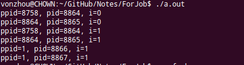
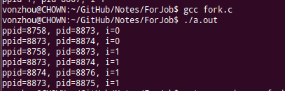
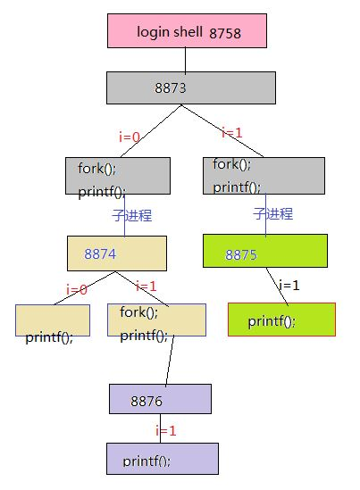

# 2013腾讯笔试题

标签（空格分隔）： 未分类

---

#### 1.以下表的设计，最合理的是（ ）

A.学生{id,name,age} ,学科{id,name} 分数{学生 id,学科 id,分数}

**分析:** 数据库设计中的范式要求：

1NF 每个关系的属性列都是不可分割的原子数据项

2NF 每个关系中都需要一个唯一的主键来标识这个关系

3NF 一个关系不依赖其他关系中的非主键项，从而避免冗余

#### 2.在数据库系统中，产生不一致的根本原因是（ ）

D.数据冗余

**分析:** 产生不一致的原因有，1）冗余，冗余可以提高系统的可靠性，但是如果更新不同步，就会带来不一致问题，2）并发控制不当，比如多线程环境下对某个记录的修改，会产生竟态，3）故障和错误

#### 3.用容积分别为15升和27升的两个杯子向一个水桶中装水，可以精确向水桶中注入（ ）升水？

C.33

**分析:** 15装满倒入27，再15装满倒入27至满，会得到3升。所以3的倍数可以获得。而且由于2个杯子都是3的倍数，所得也只能是3的倍数。

33 = 15 + 15 + 3

#### 4.考虑左递归文法S->Aa|b A->Ac|Sd|e，消除左递归后应该为（ ）？

A.
```C
S->Aa|b			
A->bdA’|A’			  
A'->cA’|adA’|e
```
**分析:** 

#### 9.在UNIX系统中，目录结构采用（ ）

D.带链接树形目录结构

**分析:** 不是纯粹的树形结构，只要保证没有环就行了，比如软符号链接的存在，可以从不同的地方指向同一个节点。

#### 10.请问下面的程序一共输出多少个“-”？
```C
int main(void)
{
    int i;
    for (i = 0; i < 2; i++) { 
        fork(); 
        printf("-"); 
    } 
    return 0; 
} 
```
D.8

**分析:** 和下面一题不同的地方在于，这里printf之后没有"\n"，所以父进程的缓冲区也会复制到子进程中，所以多出两个"-"，还要注意的是子进程退出的时候回刷新缓冲区，所以缓冲区不会复制到进程8876中，注意体会！

#### 11.请问下面的程序一共输出多少个“-”？为什么？
```C
#include <stdio.h>
#include <sys/types.h>
#include <unistd.h>
 
int main(void) {
   int i;
   for (i=0; i<2; i++) {
      fork();
      printf("-\n");
   }
   return 0;
}
```
C.6

**分析:** 一定要让子进程先运行完，使用wait，或者父进程sleep一定时间，否则子进程会成为init的child，如下所示：


运行[上述程序](fork.c)得到的结果如下：



画一个图(同一个进程用一种颜色表示)，有助于理解：



#### 12.避免死锁的一个著名的算法是（ ）

B.银行家算法

**分析:** [银行家算法](https://zh.wikipedia.org/wiki/%E9%93%B6%E8%A1%8C%E5%AE%B6%E7%AE%97%E6%B3%95)

#### 15.假定我们有3个程序，每个程序花费80%的时间进行I/O，20%的时间使用CPU。每个程序启动时间和其需要使用进行计算的分钟数如下，不考虑进程切换时间：
```
程序编号 启动时间 需要CPU时间（分钟） 
1                00：00      3.5 
2                00：10      2 
3                00：15     1.5
```
请问，在多线程/进程环境下，系统的总响应时间为（ ）

B.23.5

**分析:** 在0~10分钟，CPU利用率20%，有2分钟用在CPU上，此时1号程序还有1.5分钟才能结束; 在10至15分钟，两道程序同时运行，CPU利用率为 1 - 0.8^2 = 36%，因此5分钟里面有 5*0.36=1.8 分钟用于CPU，两程序平分这1.8分钟，因此1号程序还有0.6分钟CPU才结束，2号程序还有1.1分钟CPU才结束; 从15分钟开始，一直是3道程序同时运行直至1号程序率先结束，这段时间CPU利用率为1-0.8^3 = 48.8%，其中1号程序占用 0.6 分钟，因此总共CPU是1.8分钟，总时间为1.8/48.8%=3.6885分钟，因此进行到18.6885分钟时候，1号程序结束，2号程序还有0.5分钟CPU，3号程序还有0.9分钟CPU，两道程序运行，CPU利用率36%，直至2号程序运行结束，因此0.5*2/36%=2.7778分钟，在18.6885+2.7778=21.4663分钟时候2号程序结束，只剩下3号程序还有0.4分钟CPU使用，CPU利用率20%，因此再过0.4/20%=2分钟，所有程序结束，总时间为21.4663+2=23.4663约等于23.5。

#### 16.在所有非抢占CPU调度算法中，系统平均响应时间最优的是（ ）

B.短任务优先算法

**分析:** 短任务优先算法可以使得短任务优先执行，这样单位时间内系统的吞吐量就高，时间片轮转算法可以保证各个任务之间的公平调度，实时调度算法是考虑任务的优先级。

#### 17.什么是内存抖动（Thrashing）（ ）

A.非常频繁的换页活动

#### 18.Belady’s Anomaly出现在哪里（ ）

B.内存换页算法

**分析:** [Belady’s Anomaly](https://en.wikipedia.org/wiki/B%C3%A9l%C3%A1dy%27s_anomaly)是一种页替换算法。

#### 19.以下的生产者消费者程序中，那个不会出现锁死，并且开销最少？

D.
```C
#define N 100
typedef int semaphore;
semaphore mutex = 1;
semaphore empty = N;
semaphore full = 0;
void producer(void)
{
    int item;
    while(TRUE){
        item = produce_item();
        down(&empty);
        down(&mutex);
        insert_item(item);
        up(&full);
        up(&mutex);
    }
}
void consumer(void)
{
    int item;
    while(TRUE){
        down(&full);
        down(&mutex);
        item = remove_item();
        up(&empty);
        up(&mutex);
        consume_item(item);
    }
}
```
**分析:** 信号量 互斥量的使用

