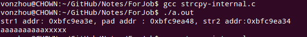
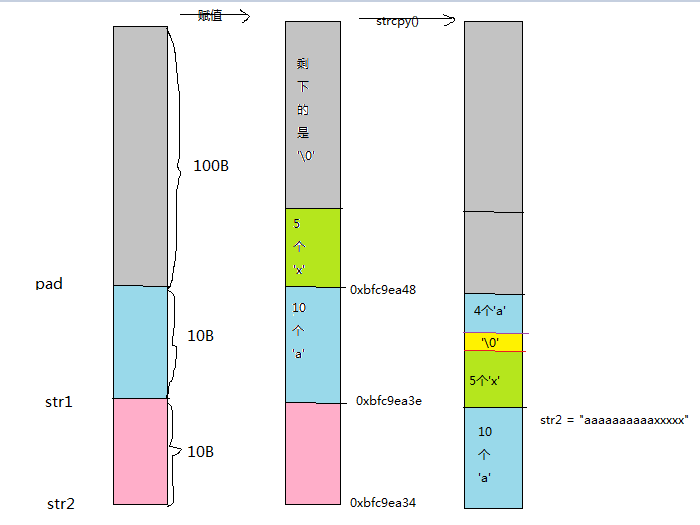
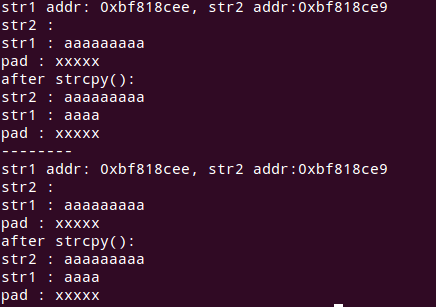
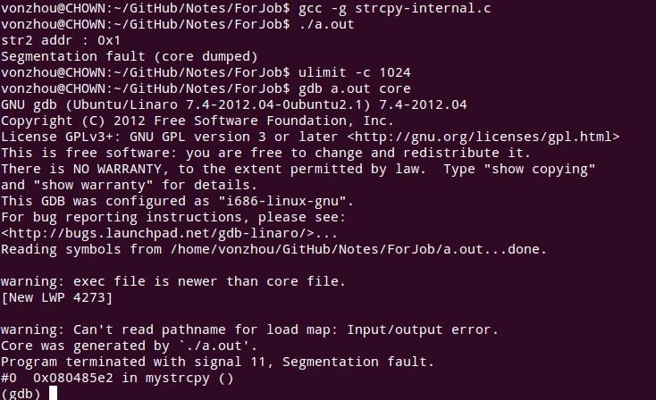

# strcpy是如何实现的？
---

#### 通过一个错误的使用示例来说明
代码如下：


你觉得运行结果是什么？

是 


根据程序中的对地址的输出，可以看到三个字符串的起始地址在栈空间中是连续的，下图画出了不同阶段的内存空间变迁图，可以很容易看到问题之所在！



**注：** 你可以调整上述不同字符串的长度，观察不同情形下的结果。

**我们会看到存在的问题有：**

* 由于strcpy是以'\0'字符作为拷贝字符的终止点，这里的str1没有足够的存储空间存'\0', 所以我们就无法确定strcpy会跑到哪里；
* 根据上述变迁图，我们看到最终我们的源字符串str1本身被改变了，这合理吗？显然我们不希望这样。

#### 所以，如果让你自己实现一个strcpy()，你会如何实现？

一个完美的答案应该要考虑：

1. 判断输入是否为空；
2. source 到 dest 的复制；
3. 返回参数是 char *类型，以便级联操作；

就可以写出下面的代码：

#### 看strcpy源码！

看了strcpy的源码实现，实现思路是差不多的。
```C
/* Copy SRC to DEST.  */
char *
strcpy (char *dest, const char *src)
{
  char c;
  char *s = (char *) src;
  const ptrdiff_t off = dest - s - 1;

  do
    {
      c = *s++;
      s[off] = c;
    }
  while (c != '\0');

  return dest;
}
```

#### 没有问题吗？

NO，当dest指向的存储空间，不足以存储src指向的字符串，就会出现问题，会覆盖其他内存空间的值，这是致命的。示例：

```C

```


我们实现的版本和库函数strcpy都是无法解决这一点的，所以一般建议使用strncpy。

#### 如何确保dest的有效性？

我们的版本中可以判断非空，但是对于一个没有初始化的指针，无论如何strcpy都是会出问题的，包括库中的strcpy。

```C

```


所以需要我们程序员在程序中保证这些！！


#### 为何glibc中采用s[off]的方式来复制字符？

采用 s[off] = *s++ 而不是 *d++ = *ss 可以性能更优，因为只需要移动一个指针。

#### 总结

1. 一个简单的strcpy需要考虑很多
2. strcpy是不安全的
3. 尽量使用strncpy()