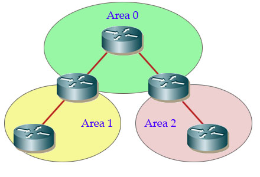
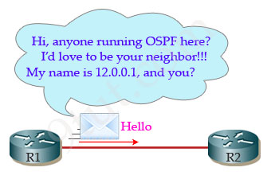
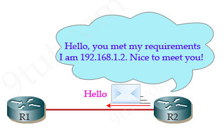
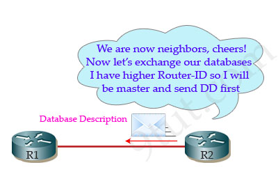
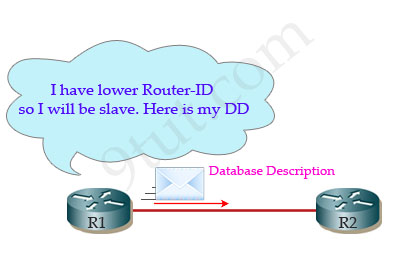
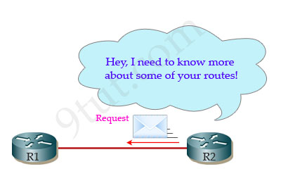
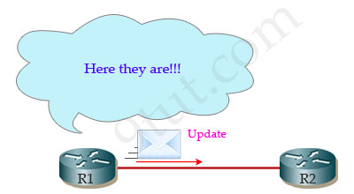
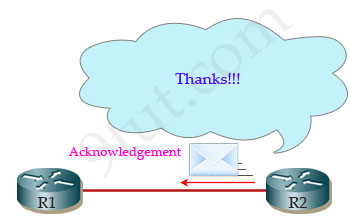

# OSPF Tutorial

标签（空格分隔）： 科研

---

In this article we will learn about the OSPF Routing Protocol Open-Shortest-Path-First (OSPF) is the most widely used interior gateway protocol routing protocol on the world because it is a public (non-proprietary) routing protocol while its biggest rival, EIGRP, is a Cisco proprietary protocol so other vendors can’t use it (edit EIGRP has become a public routing protocol since 2013). OSPF is a complex link-state routing protocol. Link-state routing protocols generate routing updates only when a change occurs in the network topology. When a link changes state, the device that detected the change creates a link-state advertisement (LSA) concerning that link and sends to all neighboring devices using a special multicast address. Each routing device takes a copy of the LSA, updates its link-state database (LSDB), and forwards the LSA to all neighboring devices.

Note

+ OSPF routers use LSA (Link State Advertisement)to describe its link state. LSDB stores all LSAs.

+ A router uses Router LSA to describe its interface IP addresses.

+ After OSPF is started on a router, it creates LSDB that contains one entry this router’s Router LSA.

There are five types of OSPF Link-State Packets (LSPs).

+ Hello are used to establish and maintain adjacency with other OSPF routers. They are also used to elect the Designated Router (DR) and Backup Designated Router (BDR) on multiaccess networks (like Ethernet or Frame Relay).

+ Database Description (DBD or DD) contains an abbreviated list of the sending router’s link-state database and is used by receiving routers to check against the local link-state database

+ Link-State Request (LSR) used by receiving routers to request more information about any entry in the DBD

+ Link-State Update (LSU) used to reply to LSRs as well as to announce new information. LSUs contain seven different types of Link-State Advertisements (LSAs)

+ Link-State Acknowledgement (LSAck) sent to confirm receipt of an LSU message

Key points

+ Is a public (non-proprietary) routing protocol.

+ Is the only link-state routing protocol you learn in CCNA

+ This works by using the Dijkstra algorithm

+ Information about its neighbors (local connectivity) is sent to the entire network using multicasting

+ Routing information is shared through Link-state updates (LSAs)

+ HELLO messages are used to maintain adjacent neighbors. By default, OSPF routers send Hello packets every 10 seconds on multiaccess and point-to-point segments and every 30 seconds on non-broadcast multiaccess (NBMA) segments (like Frame Relay, X.25, ATM).

+ Is a classless routing protocol because it does not assume the default subnet masks are used. It sends the subnet mask in the routing update.

+ Supports VLSM and route summarization

+ Uses COST as a metric which CISCO defines as the inverse of the bandwidth

+ Uses AREAs to subdivide large networks, providing a hierarchical structure and limit the multicast LSAs within routers of the same area（如何限制的？） — Area 0 is called backbone area and all other areas connect directly to it. All OSPF networks must have a backbone area

+ Only support IP but it’s not bad as we are all using IP, right )

Area Border Routers (ABR) are any routers that have one interface in one area and another interface in another area

Let’s see an example of OSPF

Suppose OSPF has just been enabled on R1 & R2. Both R1 and R2 are very eager to discover if they have any neighbors nearby but before sending Hello messages they must first choose an OSPF router identifier (router-id) to tell their neighbors who they are. The Router ID (RID) is an IP address used to identify the router and is chosen using the following sequence

+ The highest IP address assigned to a loopback (logical) interface.

+ If a loopback interface is not defined, the highest IP address of all active router’s physical interfaces will be chosen.

+ The router ID can be manually assigned

In this example, suppose R1 has 2 loopback interfaces & 2 physical interfaces

+ Loopback 0 10.0.0.1

+ Loopback 1 12.0.0.1

+ Fa00 192.168.1.1

+ Fa01 200.200.200.1

As said above, the loopback interfaces are preferred to physical interfaces (because they are never down) so the highest IP address of the loopback interfaces is chosen as the router-id - Loopback 1 IP address is chosen as the router-id.

Suppose R1 doesn’t have any loopback interfaces but it has 2 physical interfaces

+ Fa00 210.0.0.1 but it is shut down

+ Fa01 192.168.1.2 (is active)

Although Fa00 has higher IP address but it is shutdown so R1 will choose Fa01 as its router-id.

Now both the routers have the router-id so they will send Hello packets on all OSPF-enabled interfaces to determine if there are any neighbors on those links. The information in the OSPF Hello includes the OSPF Router ID of the router sending the Hello packet.

For example, R1 wants to find out if it has any neighbor running OSPF it sends a Hello message to the multicast address 224.0.0.5. This is the multicast address for all OSPF routers and all routers running OSPF will proceed this message.

If an OSPF router receives an OSPF Hello packet that satisfied all its requirement then it will establish adjacency with the router that sent the Hello packet. In this example, if R1 meet R2’s requirements, meaning it has the same Hello interval, Dead interval and AREA number, R2 will add R1 to its neighbor table.

+ Hello interval indicates how often it sends Hello packets. By default, OSPF routers send Hello packets every 10 seconds on multiaccess and point-to-point segments and every 30 seconds on non-broadcast multiaccess (NBMA) segments (like Frame Relay, X.25, ATM)

+ Dead interval number of seconds this router should wait between receiving hello packets from a neighbor before declaring the adjacency to that neighbor down

+ AREA number the area it belongs to

Now R1 and R2 are neighbors but they don’t exchange LSAs immediately. Instead, they sends Database Description (DD or DBD) packets which contain an abbreviated list of the sending router’s link-state database.

The neighbors also determine who will be the master and who will be the slave. The router which higher router-id will become master and initiates the database exchange. The receiver acknowledges a received DD packet by sending an identical DD packet back to the sender. Each DD packet has a sequence number and only the master can increment sequence numbers.

R1 or R2 can send Request to get missing LSA from its neighbors

R2 sends back an LSAck packet to acknowledge the packet.

There are 3 type of tables

+ Neighbor

+ Topology

+ Routing

Neighbor table

+ Contain information about the neighbors

+ Neighbor is a router which shares a link on same network

+ Another relationship is adjacency

+ Not necessarily all neighbors

+ LSA updates are only when adjacency is established

Topology table

+ Contain information about all network and path to reach any network

+ All LSA’s are entered into the topology table

+ When topology changes LSA’s are generated and send new LSA’s

+ On topology table an algorithm is run to create a shortest path, this algorithm is known as SPF or Dijkstra algorithm

Routing Table

+ Also knows as forwarding database

+ Generated when an algorithm is run on the topology database

+ Routing table for each router is unique

D Exchange LSDB’s list
Neighbors use DD (Data Description) to exchange their LSDB catalogs.  In this scenario, R1 sends DD to R2 first. It says I have a Route LSA from R1. R2 also sends DD to R1 I have a Route LSA from R2.

Note DD works like table for content. It lists what LSDB has, but not details. By  reading DD, the receiving router can determine what it is missing and them ask the sender to transmit required LSAs.

R1 Request, R2 Update

R1 has learned that R2 has a R2 Router LSA that it does not have.

R1 sends a LS Request to R2. When R2 receives this request, it sends an Update to transmit this LSA to R1.

R2 Request, R1 Update

R2 also sends request to R1. R1 replies an Update. Upon receiving Update, R2 adds R1 Router LSA to its LSDB, calculates its routes, and add a new entry (192.168.1.0, S10) to its routing tabe.

Note OSPF works distributely. After routers have synchronized their LSDB, they use the same data (LSDB) to calculate shortest paths, and updates their routing tables independently.

Ack update  LSAs are received
In order to assure reliable transmission, when a router receives an Update, it sends an Ack to the Update sender. If the sender does not receivie Ack within a specific peried, it times out and retransmits Update.

Note OSPF uses Update-Ack to implemnet relaible transmission. It does not use TCP.

H1 ping H2 succeeded.
Each OSPF router creates a Router LSA to describe its interfaces’ IP addresses and floods its Router LSA to its neighbors. After a few rounds of flooding, all OSPF routers have the same set of Router LSAs in their LSDBs. Now routers can use the same LSDB to calculate routes and update routing tables.

From LSDB, a router learns the entire topology the number of routers being connected. Router interfaces and their IP addresses, interface link costs (OSPF metric). With such detail information, routers are able to calculate routing paths to reach all destinations found in LSDB. For example, in the OSPF basic simulation (see External links), R1’s LSDB contains two Router LSAs – A Router LSA from R1. R1 has two links. Their IP addresses are 192.168.1.024,192.168.3.030. – A Router LSA from R2. R2 has two links. Their IP addresses are 192.168.2.024,192.168.3.030. From these LSA, R1 can calculate the routing path to reach remote destination 192.11.68.2.2 and adds an entry (192.168.2.024, S10) to its routing table.

[原文地址](httpwww.9tut.comospf-routing-protocol-tutorial)